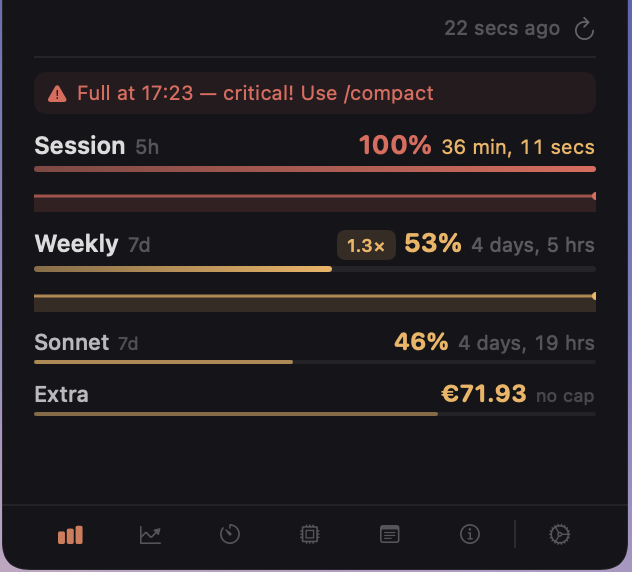
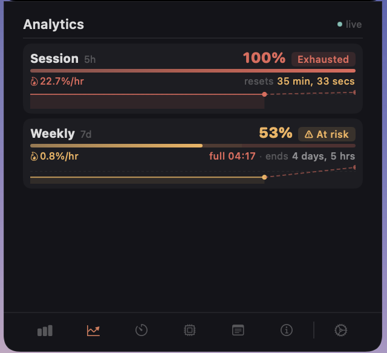
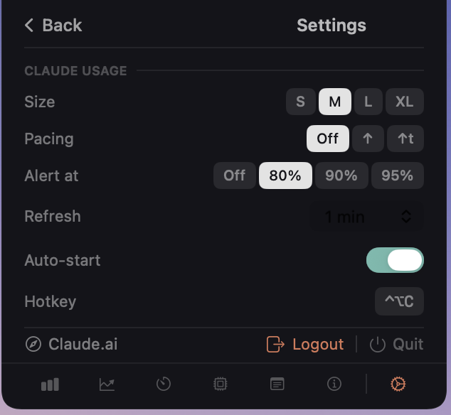
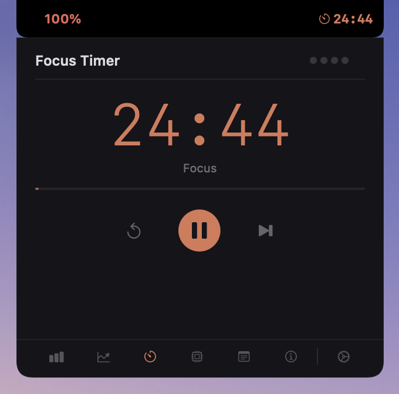
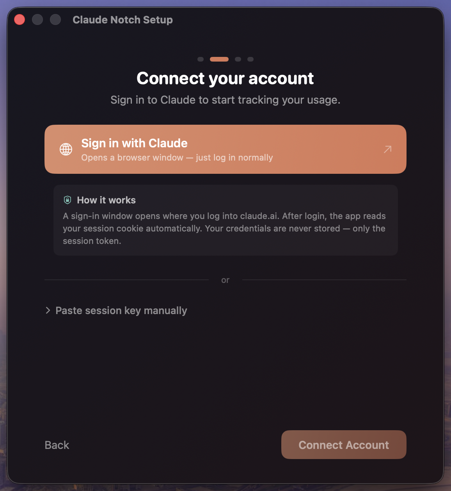

<p align="center">
  
</p>

<h1 align="center">Claude Notch</h1>

<p align="center">
  <strong>Live Claude usage stats in your MacBook's notch.</strong><br/>
  <sub>Session limits, burn rate, analytics, focus timer &mdash; always one hover away.</sub>
</p>

<p align="center">
  <a href="#features">Features</a> &bull;
  <a href="#screenshots">Screenshots</a> &bull;
  <a href="#installation">Install</a> &bull;
  <a href="#setup">Setup</a> &bull;
  <a href="#architecture">Architecture</a> &bull;
  <a href="#contributing">Contributing</a>
</p>

<p align="center">
  
  
  
  <a href="https://github.com/carlomatthaei/claude-notch/stargazers"></a>
  
</p>

<br/>

<p align="center">
  
</p>

<br/>

> **Why?** Claude Pro & Max users constantly hit session and weekly limits without warning. By the time you check `claude.ai/settings`, it's too late. Claude Notch puts your real-time usage, burn rate, and predicted limit ETA directly in the one place you always see &mdash; the notch.

---

## Features

<table>
<tr>
<td width="50%">

### Live Dashboard
- **Session** (5h) and **weekly** (7d) usage bars
- **Sonnet & Opus** model-specific tracking
- **Extra usage** spend in real $ / EUR with reset dates
- **Pacing arrows** and **burn-rate** indicators
- **Sparkline** history charts per metric

</td>
<td width="50%">

### Predictive Analytics
- Forecasts **exactly when** you'll hit limits
- Color-zoned bars: green &rarr; amber &rarr; orange &rarr; red
- **Burn rate** (%/hr) with flame indicator
- **Projected usage at reset** time
- Live updates every **10 seconds**

</td>
</tr>
<tr>
<td>

### Smart Advisor
- **34 context-aware tips** across 9 trigger categories
- Detects usage spikes &rarr; suggests `/compact`, `/clear`
- Session reset detection with fresh-start tips
- Native macOS notifications with smart cooldowns

</td>
<td>

### Notch-Native Design
- Pixel-perfect **hardware notch alignment**
- Smooth **0.22s** expand/collapse animations
- Always-on-top (`NSWindow.Level.screenSaver`)
- **4 size presets** (S / M / L / XL)
- **No Dock icon** &mdash; lives entirely in the notch

</td>
</tr>
<tr>
<td>

### Focus Timer
- Built-in **Pomodoro** (work / short break / long break)
- Session counter with cycle dots
- Timer shows **in the notch wing** while running

</td>
<td>

### Also Includes
- **System monitor** &mdash; live CPU & RAM with sparklines
- **Rich notes** &mdash; bold, italic, underline, headings, 6 colors
- **Global hotkey** &mdash; `Ctrl + Option + C`
- **Auto-updates** via GitHub Releases
- **One-click sign in** via built-in browser

</td>
</tr>
</table>

---

## Screenshots

<p align="center">
  
  &nbsp;&nbsp;
  
</p>

<p align="center">
  
  &nbsp;&nbsp;
  
</p>

<p align="center">
  
  &nbsp;&nbsp;
  
</p>

<details>
<summary>Add your own screenshots</summary>

Take screenshots of the app and save them to the `assets/` folder:
- `icon.png` &mdash; app icon (128&times;128)
- `hero.png` &mdash; hero banner (1440&times;900 recommended)
- `collapsed.png` &mdash; notch bar with usage percentages
- `expanded-stats.png` &mdash; expanded panel showing stats
- `analytics.png` &mdash; analytics page with forecast
- `settings.png` &mdash; settings page
- `focus-timer.png` &mdash; pomodoro timer
- `setup.png` &mdash; setup wizard / sign-in

</details>

---

## Installation

### Download

Grab the latest `.zip` from [**Releases**](https://github.com/carlomatthaei/claude-notch/releases), unzip, drag to Applications, done.

### Build from Source

```bash
git clone https://github.com/carlomatthaei/claude-notch.git
cd claude-notch
open ClaudeNotch.xcodeproj
```

Hit **Cmd + R** in Xcode. Requires Xcode 15+ and macOS 12 SDK.

---

## Setup

<table>
<tr>
<td>1.</td>
<td><strong>Launch</strong> Claude Notch &mdash; the setup wizard opens on first run.</td>
</tr>
<tr>
<td>2.</td>
<td>Click <strong>"Sign in with Claude"</strong> &mdash; a browser window opens.</td>
</tr>
<tr>
<td>3.</td>
<td>Log in to claude.ai normally. The app grabs your session automatically.</td>
</tr>
<tr>
<td>4.</td>
<td>Customize your display preferences.</td>
</tr>
<tr>
<td>5.</td>
<td><strong>Done.</strong> Usage stats appear beside your notch.</td>
</tr>
</table>

<details>
<summary>Manual setup (fallback)</summary>

If the built-in browser doesn't work, you can paste the session key manually:

1. Open [claude.ai](https://claude.ai) and sign in
2. Open Web Inspector &mdash; Safari: `Develop > Web Inspector` / Chrome: `F12`
3. Go to **Storage > Cookies > claude.ai** (Safari) or **Application > Cookies** (Chrome)
4. Copy the `sessionKey` cookie value
5. Paste it in the setup wizard

</details>

> **Privacy:** Only the session token is stored (locally in macOS UserDefaults). Your email and password are never seen or stored by the app. All API requests go directly to `claude.ai` &mdash; no intermediary servers, no telemetry, no tracking.

---

## Configuration

| Setting | Options | Default |
|:--------|:--------|:--------|
| Display Size | S / M / L / XL | Medium |
| Pacing Display | Off / Arrow / Arrow + Time | Off |
| Alert Threshold | Off / 80% / 90% / 95% | Off |
| Refresh Interval | 1m / 2m / 5m / 10m | 1 min |
| Focus: Work | 15m / 25m / 50m | 25 min |
| Focus: Short Break | 5m / 10m | 5 min |
| Focus: Long Break | 15m / 20m / 30m | 15 min |
| Auto-start at Login | On / Off | Off |
| Global Hotkey | &mdash; | `Ctrl+Opt+C` |

Settings are persisted across app restarts via `UserDefaults`.

---

## Architecture

```
ClaudeNotch/
├── AppDelegate.swift                 App lifecycle, screen & wake observers
├── Core/
│   ├── NotchHoverWindow.swift        Main UI: notch bar + 7-page panel
│   ├── NotchShapes.swift             Custom wing/panel bezier shapes
│   ├── HotKeyManager.swift           Carbon-based global hotkey (⌃⌥C)
│   ├── UpdateChecker.swift           GitHub Releases auto-update checker
│   └── DisplayManager.swift          Multi-display support
├── Claude/
│   ├── ClaudeUsageManager.swift      API client, cookie auth, polling, history
│   ├── ClaudeStatsSettings.swift     @Published settings with UserDefaults
│   ├── FocusTimerManager.swift       Pomodoro state machine
│   └── SystemMonitorManager.swift    CPU/RAM via host_statistics()
├── Setup/
│   ├── SetupView.swift               4-step onboarding wizard
│   └── WebLoginView.swift            WKWebView cookie-based sign-in
└── Info.plist                        LSUIElement=true (no Dock icon)
```

### Key Technical Decisions

| Decision | Why |
|:---------|:----|
| `NSWindow` at `.screenSaver` level | Always visible above all apps including fullscreen |
| `NotchWindow: NSWindow` with `canBecomeKey` | Borderless windows can't receive keyboard input by default |
| `NSHostingView.rootView` update (not replace) | Replacing the view mid-click breaks AppKit button targets |
| `LSUIElement = true` | No Dock icon, no app-switcher entry &mdash; pure notch utility |
| 4-stage ISO8601 parser | Handles fractional seconds, timezone offsets, DST transitions |
| Adaptive polling (1-5 min) | Faster when usage > 70%, saves battery when idle |
| `TimelineView(.periodic(every: 10))` | Analytics page updates without manual timers |
| `WKWebView` cookie extraction | One-click sign-in without manual DevTools cookie copying |

---

## How It Works

The app reads from the same internal API that `claude.ai/settings/usage` uses:

```
GET https://claude.ai/api/organizations/{orgId}/usage
GET https://claude.ai/api/organizations/{orgId}/subscription_details
```

Authentication uses the `sessionKey` browser cookie. The app polls at configurable intervals with adaptive rate scaling. All data processing happens locally &mdash; usage history is stored on-device for sparkline charts.

---

## Requirements

| | Minimum |
|:--|:--|
| **macOS** | 12.0 Monterey |
| **Hardware** | Any Mac (notch-aware on MacBook Pro 14"/16") |
| **Claude Plan** | Pro, Max, or Team (Free works with limited stats) |
| **Xcode** | 15.0+ (for building from source) |

Works on non-notch Macs too &mdash; uses `safeAreaInsets` with a graceful fallback.

---

## Contributing

Contributions, issues, and feature requests are welcome!

```bash
# Fork → Clone → Branch → Code → PR
git checkout -b feature/my-feature
git commit -m "Add my feature"
git push origin feature/my-feature
```

Please open an [issue](https://github.com/carlomatthaei/claude-notch/issues) first for major changes.

---

## Support

If Claude Notch saves you from hitting rate limits, consider:

<p align="center">
  <a href="https://www.paypal.com/paypalme/carlo080908">
    
  </a>
  &nbsp;&nbsp;
  <a href="https://github.com/carlomatthaei/claude-notch">
    
  </a>
</p>

---

## License

MIT &copy; 2026 [Carlo Matthaei](https://github.com/carlomatthaei). See [LICENSE](LICENSE).

<p align="center">
  <sub>Built with SwiftUI + AppKit &mdash; Not affiliated with Anthropic. Claude is a trademark of Anthropic, PBC.</sub>
</p>
